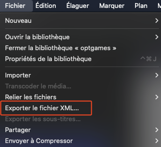

# FCPX2YT

This app allows to generate timecodes for Youtube videos from Final Cut Pro X.

First step is to add Chapter Markers in your timeline.

Then export project as xml

Copy paste the generated text from FCPX2YT app into your Youtube video description.